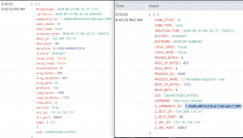
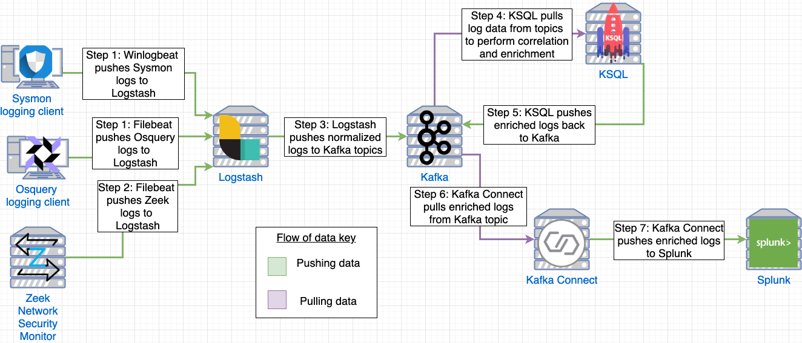

# Osquery-Zeek-Kafka

In incident response time is precious and is something you can never get back. Typically, when I receive a security alert about an endpoint it requires manual lookups on multiple data sources for critical pieces of information. These manual lookups can be time-consuming, can create fatigue, and don't use the power of technology to your advantage. This blog post will demonstrate a proof-of-concept (POC) by using the power of a network community ID hash by Corelight to fuse endpoint and network-based data sources.

KSQL by Confluent provides the ability to enrich independent data sources by correlating common attributes. In this POC, we are going to use Sysmon or Osquery to monitor the endpoint and Zeek to monitor the network. Not only will this blog post serve as a POC but it will discuss the architecture, design decisions, working infrastructure-as-code, and the knowledge I accumulated from this project. The hope is that this POC will serve as a framework for the infosec community to use to perform log enrichment. Lastly, I will demonstrate the power of this POC by detecting a Powershell Empire agent that has been injected into explorer.exe.

* [PoC: Using KSQL to enrich Zeek logs with Osquery and Sysmon data](https://holdmybeersecurity.com/2020/05/31/poc-using-ksql-to-enrich-zeek-logs-with-osquery-and-sysmon-data/)

## Problem statement
First, take a look at the screenshot on the left and attempt to determine if it's a malicious connection. Now, look at a similar log event on the right that has been enriched and tell me if it's malicious. The difference between the two log events is minimal but that process information makes a HUGE impact on your incident response capabilities and the time it takes to triage an alert. If you are not familiar with Windows systems, the process explorer.exe SHOULD NEVER be making a network connection, especially to a DigitalOcean server in Bangalore, India.

By correlating endpoint-based events and network-based events, we can get the full picture of activity occurring on a machine. The left screenshot is a standard Zeek network connection event and the right screenshot is a Zeek network connection enriched with process information data. This SMALL BUT crucial piece of information drastically changes the game and the way we develop analytics on our data and our decision making.

<p align="center">
  
</p>


## Network diagram
<p align="center">
  
</p>

## .env
This dockcer stack is pinned to certain versions in `.env`
```
CONFLUENT_VERSION=5.5.0
ROOT_LOGLEVEL=ERROR
LOGSTASH_VERSION=7.7.0
NGINX_VERSION=1.18.0-alpine
SPLUNK_VERSION=8.0.3-debian
KAFKA_CONNECT_SPLUNK=1.2.0
```

## Generate TLS certificates
1. `openssl req -x509 -nodes -days 365 -newkey rsa:2048 -keyout conf/ssl/docker.key -out conf/ssl/docker.crt`
1. `openssl dhparam -out conf/ssl/dhparam.pem 2048`

## Build pipeline and spin up stack
1. `docker-compose build`
1. `docker-compose up -d`

## Recommended system requirements
### Zeek server
* 4 CPU cores
* 4GBs of RAM
* 40GBs of HDD

### Windows 10 client
* 2 CPU cores
* 4 GBs of RAM
* 40GBs of HDD

### Logging server
* 4 CPU cores
* 12GBs of ram
* 60 GBs of HDD

## References
* [Github - CptOfEvilMinions/MyLoggingPipeline](https://github.com/CptOfEvilMinions/MyLoggingPipeline)